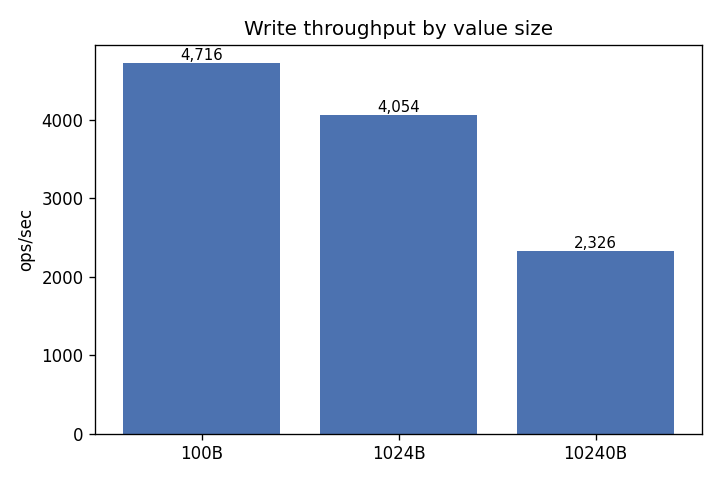
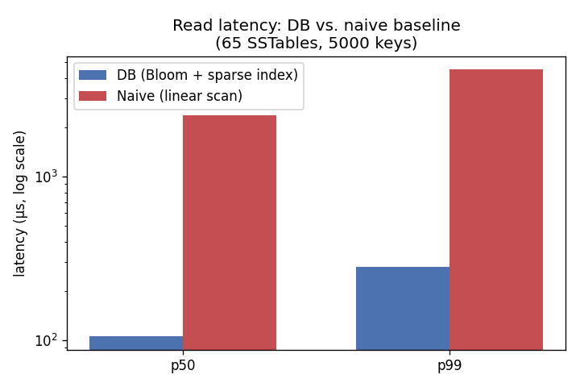
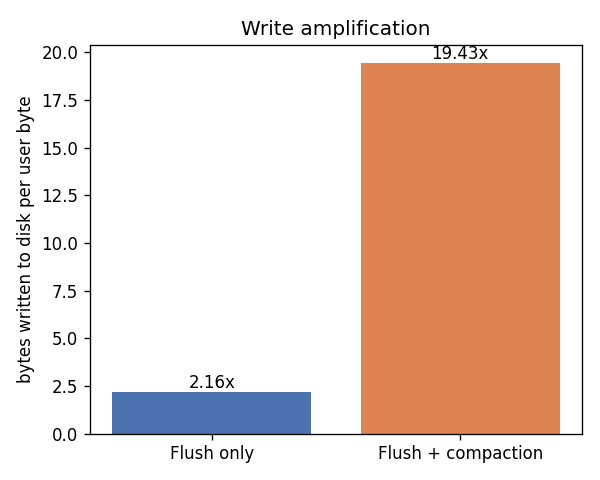

# Benchmarks

All numbers below are from an actual run of `benchmarks/run_all.py` on this machine, not estimates - regenerate them yourself with `PYTHONPATH=. python3 benchmarks/run_all.py`.

## Write throughput

| Value size | Throughput (ops/sec) |
|---|---|
| 100 bytes | 4,716 |
| 1,024 bytes | 4,054 |
| 10,240 bytes | 2,326 |

For comparison, the naive baseline (single append-only file) managed **4,576 ops/sec** at 1024-byte values - writes are `O(1)` append for both designs, so this is roughly comparable; the real story is reads, below.

## Read latency: p50 / p99, cold vs. warm

Built against 5,000 keys spread across 65 SSTables (small memtable threshold, deliberately worst-case). "Cold" = first pass of queries against a freshly-built store; "warm" = an identical second pass immediately after (benefits from OS page-cache warmth, since the sparse index and Bloom filter are already fully loaded in memory from the moment each SSTable is opened, not just after a first read).

| Workload | Store | p50 (µs) | p99 (µs) |
|---|---|---|---|
| Mixed present/absent, cold | DB | 105.87 | 279.47 |
| Mixed present/absent, warm | DB | 103.90 | 196.77 |
| Absent keys only | DB | 97.49 | 688.54 |
| Mixed present/absent, cold | Naive | 2358.91 | 4509.67 |
| Mixed present/absent, warm | Naive | 2346.37 | 3864.26 |
| Absent keys only | Naive | 2356.21 | 3747.70 |

For absent keys specifically - the case a Bloom filter is built for - the real DB's p99 is **5.4x faster** than the naive baseline's.

## Write amplification

"Write amplification" = total bytes physically written to disk over the life of the data, divided by bytes of user data actually written. Measured empirically (instrumented at every real file write - WAL, SSTable data, sparse index, Bloom filter, and every compaction rewrite), not estimated.

| Scenario | User data | Total bytes written | Amplification |
|---|---|---|---|
| Flush only, unique keys, no compaction | 336,000 B | 726,680 B | 2.16x |
| Flush + compaction, 6 overwrites/key | 56,000 B | 1,087,864 B | 19.43x |

The flush-only number is pure overhead from durability and read-speed structures: every byte goes through the WAL once, then gets rewritten into an SSTable, plus the sparse index and Bloom filter sidecar files. The compaction number additionally reflects 3,000 total writes (6 overwrites of each of 500 keys) collapsing down to just the live values - compaction trades extra rewrite I/O now for reclaiming space from dead versions and keeping future reads fast. Note this second scenario is a deliberately worst-case synthetic workload (every key overwritten 6x, small values so per-record header overhead dominates) specifically to make the compaction rewrite cost visible - a real workload with fewer overwrites per key would land well below 19.4x.

