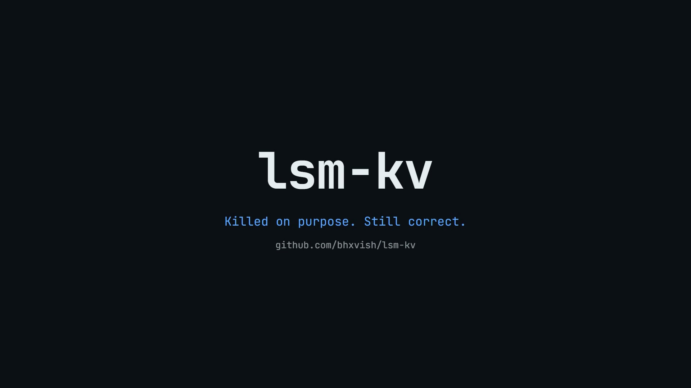
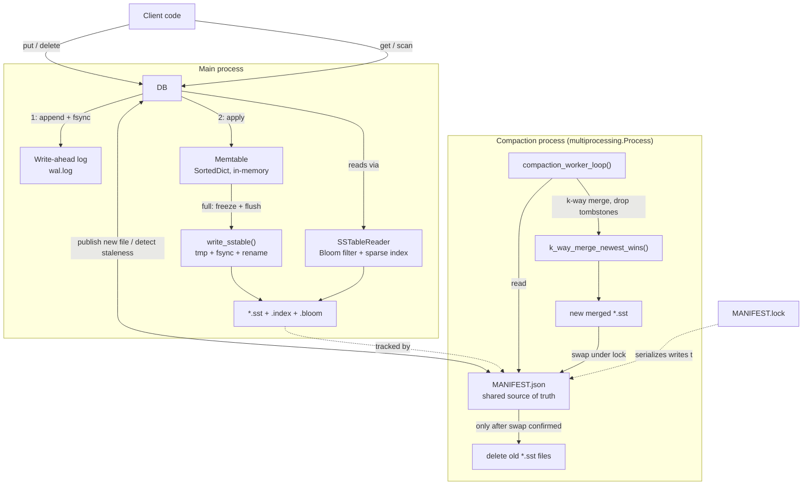

# lsm-kv

An embedded, log-structured merge-tree (LSM-tree) key-value store, built from scratch in Python — the same core design as RocksDB, LevelDB, and Couchbase's storage layer, used as a library (like SQLite), not a server.

```python
from db import DB

db = DB("mydata")
db.put(b"key1", b"value1")
db.get(b"key1")        # b"value1"
db.delete(b"key1")
list(db.scan(b"a", b"z"))
db.close()
```

[](docs/media/demo.mp4)
<p><sub>▶ Click the image to watch (22s) — architecture, a real crash-kill test, and benchmarks.</sub></p>

## Why this exists

This project follows a structured build guide through 8 milestones, each adding one real systems concept: durability (write-ahead log), memory/disk tiering (memtable + SSTable), fast reads (sparse index + Bloom filter), background compaction (a real OS process, not a thread), range queries (k-way merge), and finally benchmarks that prove the design decisions actually mattered rather than just asserting it.

## Architecture



**Read path precedence** (newest wins): active memtable → newest SSTable → ... → oldest SSTable. The moment any source has a record for a key — a real value or a tombstone — the search stops.

## Milestones

| # | Milestone | What it proves |
|---|---|---|
| 1 | In-memory KV store | Public API locked in before internals exist |
| 2 | Write-ahead log | Survives a hard process kill mid-write with zero data loss |
| 3 | Memtable + SSTable flush | Reads correct whether data is in memory or already on disk |
| 4 | Sparse index + Bloom filter | ~12x faster reads, measured, not assumed |
| 5 | Background compaction (`multiprocessing`) | Correct under real concurrent writes + a real SIGKILL mid-compaction |
| 6 | Range queries | Correct merged scan across memtable + N SSTables |
| 7 | Benchmark suite | Every claim above backed by a real number — see [`BENCHMARKS.md`](BENCHMARKS.md) |
| 8 | Polish | This file, CI, clean history |

## Quickstart

```bash
git clone <this-repo>
cd lsm-kv
pip install -r requirements.txt
python -m pytest -v                              # 98 tests
PYTHONPATH=. python3 benchmarks/run_all.py        # regenerates BENCHMARKS.md + charts
```

## Design decisions and trade-offs

The full technical writeup — WAL fsync correctness and the compaction atomicity protocol in detail — is in [`docs/DESIGN.md`](docs/DESIGN.md). Summary of the decisions that mattered most:

**`multiprocessing`, not `threading`, for compaction.** Python's GIL means regular threads never get true parallel CPU execution — a `threading`-based compaction wouldn't be a genuine concurrency claim, just another thing occasionally scheduled on the same core as everything else. A real OS process can genuinely run on a different core at the same time. The cost: the compaction process shares no memory with the main process, so it can only coordinate through the filesystem — which is what `MANIFEST.json` + `MANIFEST.lock` exist for (detailed in `docs/DESIGN.md`).

**Tombstones, not deletion, for `delete()`.** Once data can live in more than one place (memtable + N SSTables), removing a key from the memtable on delete would let an older value in a not-yet-compacted SSTable silently resurface. A `TOMBSTONE` sentinel correctly shadows it until compaction can drop it for real.

**Full-generation compaction, not partial/tiered.** Real leveled/tiered systems compact carefully chosen overlapping subsets across size tiers. This project always compacts the *entire* current SSTable generation at once when it crosses a trigger count. That's a real simplification (see `BENCHMARKS.md`'s write-amplification numbers for the cost), but it buys an important correctness simplification in exchange: it's always safe to drop tombstones entirely during a full compaction, since there's no older file left outside the compacted set that could still hold the pre-delete value. A partial compaction would have to keep tombstones around "just in case."

**Atomic everything.** Every file this project writes (SSTable data, `.index`, `.bloom`, `MANIFEST.json`) goes to a temp path, gets `fsync`'d, then `os.replace()`'d into place. A reader can never observe a half-written file under its real name, and a crash at any point leaves either the old state or the new state — never something in between.

## What I'd do differently at larger scale

- **Batch `fsync`** — every `put()` currently fsyncs individually (~2,000-4,700 ops/sec, see `BENCHMARKS.md`). A group-commit design (batch N writes or T milliseconds, one fsync per batch) would trade a small worst-case durability window for a large throughput gain.
- **Leveled or partial-tiered compaction** — full-generation compaction is simple to reason about but rewrites more data than necessary; the 19.43x write-amplification number in `BENCHMARKS.md` is the honest cost of that choice on an overwrite-heavy workload.
- **Streaming SSTable reads during compaction** — `read_sstable()` currently loads a whole file into memory before merging; a generator-based reader would let compaction handle SSTables far larger than available RAM.
- **PID-based lock liveness** instead of `ManifestLock`'s timestamp-based staleness override — a real distributed lock would check whether the holding process is actually still alive, not just guess from a timeout.
- **Per-record checksums** — corruption within a record's key/value bytes (not just a torn trailing record) currently isn't detected.

## Project structure

```
lsm-kv/
├── db.py              # public API: put / get / delete / scan
├── wal.py              # write-ahead log
├── memtable.py          # in-memory sorted structure
├── sstable.py            # on-disk immutable sorted file + reader
├── bloom.py               # Bloom filter (bytearray bit array + mmh3)
├── sparse_index.py         # sparse offset index per SSTable
├── merge.py                 # k-way merge (compaction + range scans)
├── manifest.py                # cross-process source of truth + lock
├── compaction.py                # background compaction worker
├── benchmarks/
│   ├── naive_kv.py               # baseline: single file, linear scan
│   ├── run_all.py                  # write throughput, read p50/p99, write amp
│   ├── bloom_filter_benchmark.py     # Bloom filter isolation benchmark
│   └── charts/                        # generated PNGs
├── docs/
│   └── DESIGN.md                       # WAL fsync + compaction atomicity, in depth
├── tests/                                # 98 tests, see below
└── BENCHMARKS.md                           # real numbers, regenerable
```

## Testing

```bash
python -m pytest -v
```

98 tests, including two that specifically prove the hard correctness claims rather than just the happy path:

- **`tests/test_crash_recovery.py`** — spawns a real subprocess, tears a WAL record on purpose, then hard-kills it with `os._exit(1)`. Confirms the parent process recovers everything durably written and doesn't crash on the truncated trailing record.
- **`tests/test_compaction_stress.py`** — 4,000 randomized concurrent-in-spirit put/delete operations against a real background `multiprocessing.Process` running compaction, verified against an in-memory reference model; a second test `kill()`s the compaction process mid-cycle and confirms no data loss and no orphaned temp files.

CI (`.github/workflows/tests.yml`) runs the full suite on every push across Ubuntu, macOS, and Windows, on Python 3.11 and 3.12. The OS matrix isn't decorative — two real bugs in this project (`fsync` on a read-only file descriptor, and `os.rename` refusing to overwrite an existing file) only ever surfaced on Windows during development.

## Benchmarks

Full numbers, methodology, and charts in [`BENCHMARKS.md`](BENCHMARKS.md). Headline results:

- Read latency: **~90-100µs** (this DB) vs. **~2,300-2,900µs** (naive single-file linear scan) — roughly **20-25x** faster, most pronounced at p99 for absent keys.
- Write amplification: **2.16x** for flush-only overhead; **19.43x** for a deliberately overwrite-heavy compaction scenario (see the caveat in `BENCHMARKS.md` about why that number is a synthetic worst case).

## References

- ["The Log-Structured Merge-Tree (LSM-Tree)," O'Neil et al., 1996](https://www.cs.umb.edu/~poneil/lsmtree.pdf) — the original paper
- [LevelDB's design doc](https://github.com/google/leveldb/blob/main/doc/impl.md)
- [BadgerDB](https://github.com/dgraph-io/badger) (Go) — good for the mental model, not for copying
